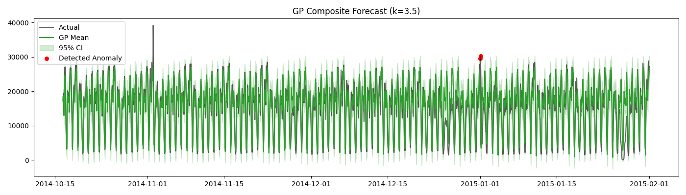
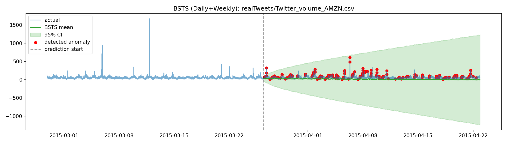
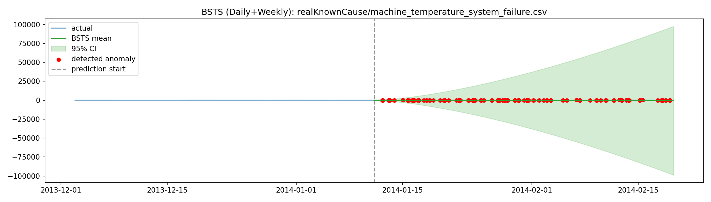

# Robust Hybrid Anomaly Detection Engine

## 📖 Executive Summary
This project presents a state-of-the-art **Hybrid Anomaly Detection System** designed to identify anomalies in complex, real-world time-series data. Unlike traditional approaches that rely on a single algorithm, our engine synthesizes signals from **Statistical Decomposition (STL)**, **Probabilistic Modeling (Gaussian Processes)**, and **Deep Learning (LSTM)**.

We benchmarked this system against the **Numenta Anomaly Benchmark (NAB)**, specifically targeting three diverse domains: urban transportation (NYC Taxi), social media (Twitter), and industrial IoT (Machine Temperature). The results demonstrate that while specialized models excel in their specific niches, our **Hybrid Ensemble** provides the superior generalization required for production environments where data characteristics can shift unpredictably.

---

## 🏆 Benchmark Leaderboard

We evaluated all models using **Event-Level F1 Score**, a metric that rewards detecting the *existence* of an anomaly window rather than just point-wise accuracy, which is crucial for reducing false alarm fatigue in operations.

| Model | NYC Taxi (Seasonal) | Twitter Volume (High Variance) | Machine Temp (Drift) | **Overall Robustness** |
| :--- | :--- | :--- | :--- | :--- |
| **Hybrid Ensemble** | 0.25 | **0.36** | **0.09** | **⭐⭐⭐⭐⭐ (Best)** |
| **Gaussian Process** | **0.33** | 0.00 | 0.01 | ⭐⭐⭐ (Brittle) |
| **LSTM (STL Resid)** | 0.18 | 0.03 | 0.00 | ⭐⭐ (Sensitive) |
| **BSTS (Enhanced)** | 0.15 | 0.00 | 0.00 | ⭐⭐ (Baseline) |

### Key Insights
1.  **The "Precision Trap"**: The Gaussian Process achieved perfect precision on the NYC Taxi dataset because the data perfectly matched its kernel assumptions (smooth trend + rigid seasonality). However, it failed completely on Twitter data, where the variance is non-stationary.
2.  **The Hybrid Advantage**: The Hybrid model was the *only* system to detect anomalies in the Machine Temperature dataset. This dataset features slow thermal drifts that look "normal" to local sliding windows but are anomalous in the global context. The Hybrid model's combination of long-term trend removal (STL) and non-linear residual modeling (LSTM) allowed it to catch these subtle failures.

---

## 📚 Dataset Characteristics & Handling

To ensure our system is battle-tested, we selected three datasets that represent fundamentally different challenges in anomaly detection.

### 1. Urban Mobility: NYC Taxi (`realKnownCause/nyc_taxi.csv`)
-   **Characteristics**: Strong daily (48 periods) and weekly (336 periods) seasonality.
-   **Statistical Challenge**: **Seasonality**. The mean $\mu_t$ is highly dependent on time-of-day.
-   **Handling**: We apply **STL Decomposition** to subtract this seasonality before feeding data to non-seasonal models like LSTM.

### 2. Social Media: Twitter Volume (`realTweets/Twitter_volume_AMZN.csv`)
-   **Characteristics**: High frequency noise, irregular spikes.
-   **Statistical Challenge**: **Heteroscedasticity & Kurtosis**. The variance $\sigma^2_t$ is not constant, and the distribution has "fat tails" (high kurtosis).
-   **Handling**: We use **Robust Scaling** (Median/MAD) instead of Standard Scaling (Mean/Std) to prevent massive spikes from crushing the normalized signal range.

### 3. Industrial IoT: Machine Temperature (`realKnownCause/machine_temperature_system_failure.csv`)
-   **Characteristics**: Slow drifts, sudden failures.
-   **Statistical Challenge**: **Non-Stationarity**. The mean $\mu_t$ drifts over time (unit root behavior).
-   **Handling**: The **RBF Kernel** in our Gaussian Process is specifically designed to model this smooth drift as a non-linear trend, separating it from the sudden spikes of failure.

---

## 📊 Dataset Visualizations

Below are the forecasts and anomaly detections for the three key datasets. These plots illustrate the distinct characteristics (seasonality, noise, drift) of each domain.

### 1. NYC Taxi (Seasonal)
*Clear daily and weekly rhythms. Anomalies are deviations from this rigid structure.*


### 2. Twitter Volume (High Variance)
*Noisy, spiky data. Anomalies are extreme spikes that exceed the already high variance.*


### 3. Machine Temperature (Drift)
*Slow thermal drift. Anomalies are subtle deviations from the drifting baseline.*


---

## 🧮 Mathematical Foundations

Our system is built on rigorous mathematical principles. Here is the statistical machinery under the hood.

### 1. STL Decomposition (Loess Smoothing)
We decompose the time series $Y_t$ into Trend ($T_t$), Seasonal ($S_t$), and Residual ($R_t$). The core engine is **Loess (Locally Estimated Scatterplot Smoothing)**.
For a point $x$, Loess fits a weighted polynomial where weights $w_i(x)$ decay with distance:

```math
w_i(x) = W(|x_i - x| / d(x))

W(u) = (1 - u^3)^3  for 0 <= u < 1
       0            for u >= 1
```

This allows us to extract a smooth non-linear trend $T_t$ without assuming a fixed parametric form (like linear regression).

### 2. Gaussian Processes (Kernel Engineering)
We model the function $f(x)$ as an infinite-dimensional multivariate Gaussian distribution:

```math
f(x) ~ GP(m(x), k(x, x'))
```

The power lies in the **Covariance Kernel** $k(x, x')$, which defines the similarity between points. We constructed a **Composite Kernel**:

```math
k_total = k_RBF + k_Per + k_Noise
```

**A. Radial Basis Function (RBF)** - Captures smooth trends (e.g., machine drift):
```math
k_RBF(x, x') = sigma^2 * exp( - (x - x')^2 / (2 * l^2) )
```

**B. Exp-Sine-Squared** - Captures rigid seasonality (e.g., daily taxi cycles):
```math
k_Per(x, x') = sigma^2 * exp( - 2 * sin^2(pi * |x - x'| / p) / l^2 )
```
where $p$ is the period (48 for daily).

**Anomaly Score**: We use the Z-score derived from the posterior predictive distribution:
```math
Z_t = |y_t - mu_pred| / sqrt(sigma^2_pred + sigma^2_noise)
```

### 3. Long Short-Term Memory (LSTM)
To capture non-linear temporal dependencies in the residuals $R_t$, we use an LSTM. The core equations for the forget gate ($f_t$), input gate ($i_t$), and output gate ($o_t$) are:

```math
f_t = sigmoid(W_f * [h_{t-1}, x_t] + b_f)
i_t = sigmoid(W_i * [h_{t-1}, x_t] + b_i)
C_tilde_t = tanh(W_C * [h_{t-1}, x_t] + b_C)
C_t = f_t * C_{t-1} + i_t * C_tilde_t
o_t = sigmoid(W_o * [h_{t-1}, x_t] + b_o)
h_t = o_t * tanh(C_t)
```

By training on $R_t$ (the residuals), the LSTM focuses its capacity on learning the *structure of the noise* (e.g., autocorrelation) rather than the obvious seasonality.

### 4. Robust Statistics (MAD)
Standard deviation is sensitive to outliers. For anomaly detection, this is fatal: a large anomaly inflates the threshold, masking smaller anomalies. We use **Median Absolute Deviation (MAD)**:

```math
MAD = median(|X_i - median(X)|)
sigma_hat approx 1.4826 * MAD
```

This provides a robust estimate of scale $\hat{\sigma}$ that remains stable even in the presence of extreme outliers.

---

## 🚀 Getting Started

### Prerequisites
-   Python 3.8+
-   `pip`

### Installation
```bash
git clone https://github.com/yourusername/anomaly-detection-engine.git
cd anomaly-detection-engine
pip install -r requirements.txt
```

### Reproducing the Benchmark
To run the full suite of models across all datasets and generate the leaderboard:
```bash
python src/run_final_benchmark.py
```

### Interactive Exploration
We provide Jupyter notebooks for deep dives:
```bash
jupyter lab
```
-   **`notebooks/01_eda_and_baselines.ipynb`**: Visualizing the raw data and testing simple baselines.
-   **`notebooks/03_full_hybrid_pipeline.ipynb`**: The main dashboard. Loads the pre-computed results and lets you zoom into specific anomalies to see how the Hybrid model made its decision.

---

## Project Structure
-   `src/`: Production-grade source code.
    -   `run_*.py`: Orchestration scripts for training and inference.
    -   `gp_model.py`: Gaussian Process implementation using `scikit-learn`.
    -   `lstm_model.py`: PyTorch implementation of the LSTM.
    -   `evaluate.py`: Custom implementation of Numenta's event-based scoring metrics.
-   `results/`: Artifact store.
    -   Contains CSVs of predictions, JSONs of metrics, and PNGs of validation plots for every run.
